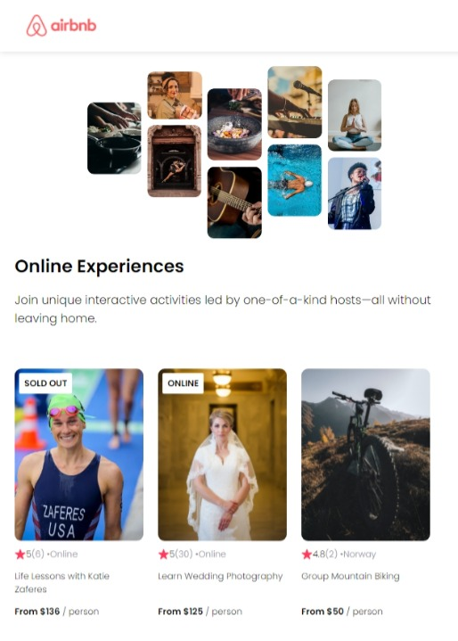

# AirBnb Clone from Scrimba

This is a project from the [Learn React course](https://scrimba.com/learn/learnreact) from [Scrimba](https://scrimba.com/).

### Screenshot

### Links

- [View Code](https://github.com/elizerdim/react-airbnb-clone)
- [Live Preview](https://react-airbnb-clone-k58hnmya8-eliz-erdims-projects.vercel.app/)

### Built with

- HTML
- CSS
- React

### What I learned

I completed this simple project on Scrimba back in September 2023 when I was first learning React and wanted to include it here for reference. I noticed that image source paths don't work as written in the tutorial, so I did a little research and found out that they should either be imported or put into public folder and used with an absolute path. I also learned that deploying React projects with GitHub is tricky and so deployed this project with Vercel. 

- Use public folder for images in React projects
- Deploy React projects with Vercel

### Useful resources

- [import image](https://stackoverflow.com/a/62933974) - using relative paths in React projects doesn't work, so importing them to the file is an option to use them
- [use public folder](https://stackoverflow.com/a/61783390) - another option is to put the images in the public folder and use an absolute path without /public at the beginning